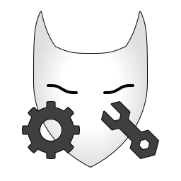

  <h1>
    
    东方银狐的奇妙工具
  </h1>
  
专注于 Godot 游戏开发、经典 RTS 游戏引擎与任务创作的独立团队。（一个人也算团队吗）

  
  
  

---

<table>
  <tr>
    <td width="33%" align="center">
      <!-- 添加了    让高度和其他两个卡片对齐，确保第一行在同一水平线上 -->
      <h3>🎮 Godot Custom Controls  </h3>
      
给 Godot 引擎做的自定义控件，比 Godot 自带的控件有更多功能

      <a href="https://github.com/SilverFox-Tools/SilverFox-GodotCustomControls">📦 查看项目</a>
    </td>
    <td width="33%" align="center">
      <!-- 同样添加了    确保高度绝对一致 -->
      <h3>⚙️ CNC/YR Engine Extension  </h3>
      
针对西木（Westwood）《红色警戒2：尤里的复仇》引擎的简易扩展。

      <a href="https://github.com/SilverFox-Tools/SilverFox--CNCYR-EngineExtension">📦 查看项目</a>
    </td>
    <td width="33%" align="center">
      <!-- 保持原样，因为它原本就是两行 -->
      <h3>🎖️ RedAlert2 Mission Editor （开发中）</h3>
      
为《红色警戒2》打造的战役任务序列可视化编辑工具，轻松修改战役的顺序。

      <a href="https://github.com/SilverFox-Tools/RedAlert2-MissionSequence-Editor">📦 查看项目</a>
    </td>
  </tr>
</table>
